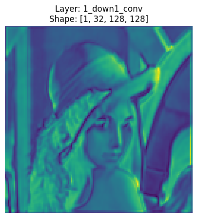
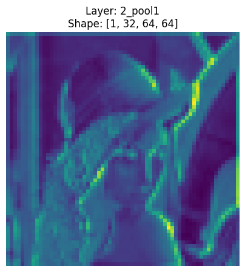
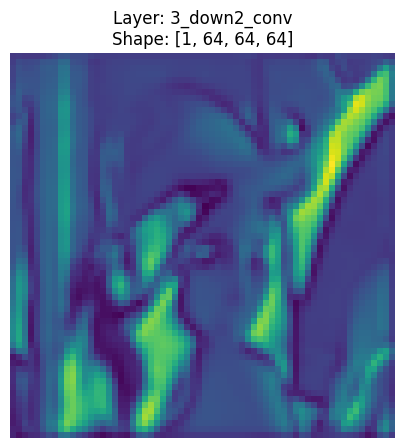
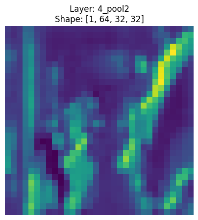
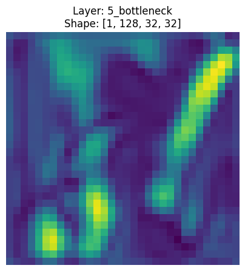
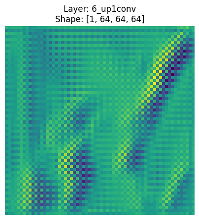
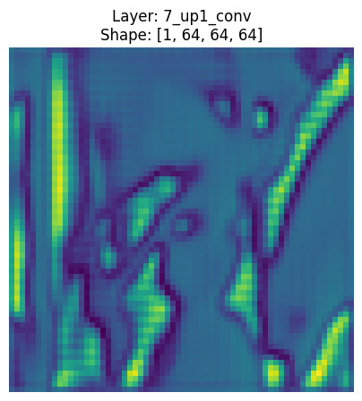
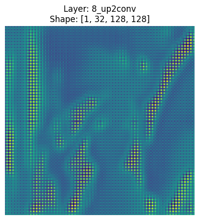
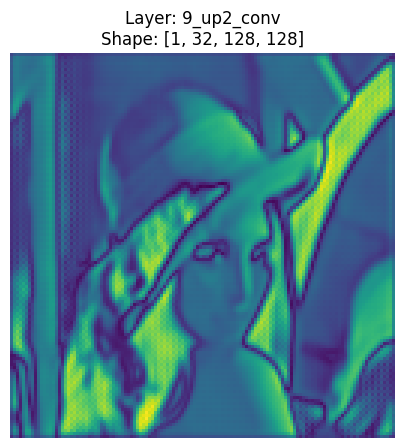

# Visualizing What U-Net Actually Sees

The best way to learn U-Net is to visualize what each section is doing. For that reason, I used a single image and trained the U-Net architecture to overfit it. Next, I generated images from the output of each operation. However, the images are not exactly what the model sees, as the outputs have channels like 128, 64, 32, etc. A computer can only show us images with either 3 channels or 1 channel. So I had to average the high-dimensional value of each pixel to generate an image that both a computer and a human eye can comprehend.

Before diving into details, let's introduce what a U-Net architecture is.

A U-Net architecture has two sections: the encoder (for downsampling) and the decoder (for upsampling).

Downsampling constantly increases the channels (dimensions) and decreases the pixel count. The CNN blocks in this section try to learn edges, corners, and eventually shapes. The decoder then tries to bring back the information that might have been lost during downsampling by using skip connections. A skip connection is basically concatenating the source matrix with the upsampled matrix. Upsampling decreases the dimensions and increases the pixel count to regenerate the image so it can match the ground truth.

## The Code

```python
import torch
import torch.nn as nn

class DoubleConv(nn.Module):
    """(Conv2d -> BatchNorm -> ReLU) * 2"""
    def __init__(self, in_channels, out_channels):
        super().__init__()
        self.double_conv = nn.Sequential(
            nn.Conv2d(in_channels, out_channels, kernel_size=3, padding=1),
            nn.BatchNorm2d(out_channels), # stabilizer — across the batch, the values for each channel get a mean of 0 and std of 1
            nn.ReLU(inplace=True),
            nn.Conv2d(out_channels, out_channels, kernel_size=3, padding=1),
            nn.BatchNorm2d(out_channels),
            nn.ReLU(inplace=True)
        )

    def forward(self, x):
        return self.double_conv(x)
# Why BatchNorm then ReLU? ReLU turns negative numbers into 0. The normalization would have to work with partial information if ReLU came before it.
# Why doesn't it matter that ReLU deletes information? The network quickly learns that ReLU kills negative numbers. So if a negative feature is important,
# the network uses a different channel to flip the number by multiplying it with a negative weight, so the information isn't lost.
# ReLU is important because it cancels out noise.

class UNet(nn.Module):
    def __init__(self, in_channels=3, out_channels=3):
        super().__init__()

        self.down1 = DoubleConv(in_channels, 32) # b,p,3 becomes b,p,32
        self.pool1 = nn.MaxPool2d(2) # b,p,32 becomes b,p/2,32
        self.down2 = DoubleConv(32, 64)  # b,p,32 becomes b,p,64
        self.pool2 = nn.MaxPool2d(2) # a single pool would technically be enough since max pool has no learned weights, but I followed convention
        self.bottleneck = DoubleConv(64, 128)  # b,p,64 becomes b,p,128

        self.upconv1 = nn.ConvTranspose2d(128, 64, kernel_size=2, stride=2) # shape b, p*4, 64
        self.up1 = DoubleConv(128, 64) # 128 because of skip connection (64+64)
        self.upconv2 = nn.ConvTranspose2d(64, 32, kernel_size=2, stride=2) # shape b, p*4, 32
        self.up2 = DoubleConv(64, 32) # 64 because of skip connection (32+32)
        self.out_conv = nn.Conv2d(32, out_channels, kernel_size=1)
        self.sigmoid = nn.Sigmoid()

    def forward(self, x):
        features = self.extract_features(x)
        return features['final_output']

    def extract_features(self, x):
        features = {}

        features['1_down1_conv'] = self.down1(x)
        features['2_pool1'] = self.pool1(features['1_down1_conv'])
        features['3_down2_conv'] = self.down2(features['2_pool1'])
        features['4_pool2'] = self.pool2(features['3_down2_conv'])
        features['5_bottleneck'] = self.bottleneck(features['4_pool2'])

        features['6_up1conv'] = self.upconv1(features['5_bottleneck'])
        # skip connection: expands the figure and adds back the details lost during bottleneck downsampling
        concat1 = torch.cat([features['3_down2_conv'], features['6_up1conv']], dim=1)
        features['7_up1_conv'] = self.up1(concat1)
        features['8_up2conv'] = self.upconv2(features['7_up1_conv'])
        concat2 = torch.cat([features['1_down1_conv'], features['8_up2conv']], dim=1)
        features['9_up2_conv'] = self.up2(concat2)

        out = self.out_conv(features['9_up2_conv'])
        features['final_output'] = self.sigmoid(out)
        return features
```

## How I Understand What's Happening Inside

### Conv2d (the "going down" step)

`nn.Conv2d(3, 64, kernel=3)` — let's say the pixel count is 512.

1. The kernel is 3x3x3 (the 3 in shape[2] comes from the in_channel count).
2. The kernel slides across the 3D matrix.
3. At a time, it covers 9 pixels, and each pixel has 3 values — that's 27 multiplications at a time.
4. All 27 values get summed together, and 9 pixels with 3 dimensions each collapse into one unified value with just 1 dimension.
5. Here we use stride=1, but stride alone isn't what keeps the pixel count the same — it's the padding doing that job. The kernel moves horizontally: if it processes pixels 0,0 to 2,2 first, next it processes 0,1 to 2,3.
6. Since out_channel = 64, there will be 64 such unified scores per pixel.
7. So the shape would be 64, pixel_count.
8. And after swapping, pixel_count, 64.
9. padding = (kernel - 1) / 2.
10. To keep the pixel count consistent, padding is required.

### ConvTranspose2d (the "going back up" step)

1. For all 128 in-channels, there's a 2x2 kernel each.
2. An element-wise multiplication happens between a single pixel and the kernel.
3. Each pixel has values across 128 dimensions.
4. Each value of a pixel is multiplied by its corresponding kernel value, and all of that eventually gets summed up together.
5. So now each pixel has transformed into a [2,2] matrix.
6. But that's only for one channel. For all 64 output channels, each pixel ends up with 64 sets of 2x2 values.
7. So the shape of the output becomes 64, pixel_count, 2, 2. If the pixel count was 64, flattening the matrix makes it 256.
8. So the final shape is 64, 256.
9. Since CNNs are channel-first, we swap it and it becomes 256, 64 — meaning 256 pixels now have 64 dimensions each. The image has expanded.
10. Pixel count calculation: if there are 64 pixels, meaning 8x8, the side count = (8-1)\*stride + kernel = 7\*2 + 2 = 16. Total = 16x16.
11. If stride > kernel, there will be gaps between pixels. Those gaps get filled with 0s, since PyTorch first creates an empty canvas filled with 0s for the expanded image.

### The final 1x1 conv

`self.out_conv = nn.Conv2d(32, 3, kernel_size=1)`

Say there are 256 pixels, and each pixel has 32 values. Kernel = 1 means a 1x1x32 shape, so it only covers 1 pixel at a time. The 32 values get multiplied by their corresponding kernel values and summed together, so 1 pixel now has 1 value. So 256 pixels have 256 values, and for 3 output channels, the final shape is 3, 256.

### Conv2d vs ConvTranspose2d

Conv2d can change the channel count, but it can't increase the spatial size — it can only keep it the same or shrink it. If kernel=3, stride=1, padding=0, the figure loses 2 columns and 2 rows. With stride=2, it shrinks by roughly half instead, since the kernel only lands on every other pixel.

Because of this, you *could* use Conv2d as a stand-in for ConvTranspose2d by blindly doubling the image size first and then applying Conv2d. But in my opinion, ConvTranspose2d is the more sophisticated way to expand an image.

## Visualizing Each Stage

The model was trained on a single image for 200 epochs to overfit it. During inference, I ran the same image through and saved the output at each operation, then averaged the channel values down to something displayable (3 channels or 1), since a screen can't render a 64- or 128-channel image directly.

| Stage | Image |
|---|---|
| Original input |  |
| Downsample 1 (`down1` output) |  |
| Pool 1 |  |
| Downsample 2 (`down2` output) |  |
| Pool 2 |  |
| Bottleneck |  |
| Upsample 1 (`upconv1` output) |  |
| Up 1 (`up1` output, after skip concat) |  |
| Upsample 2 (`upconv2` output) |  |
| Up 2 (`up2` output, after skip concat) |  |
| Final output |  |

*(Drop the corresponding PNGs into an `images/` folder in the repo — the filenames above are placeholders you can rename to match.)*
